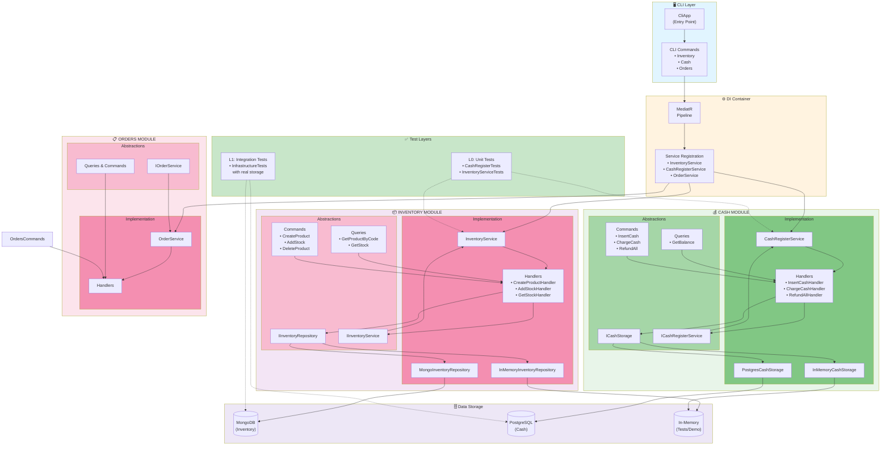
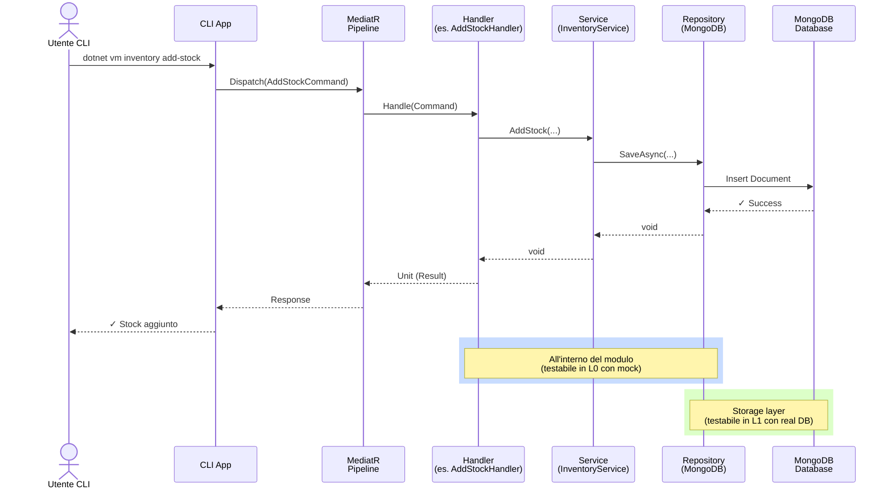
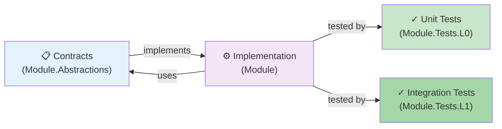

# Architettura - Vending Machine Modular Monolith

## Overview - ASCII Art

```
╔════════════════════════════════════════════════════════════════════════════╗
║                    VENDING MACHINE - MODULAR MONOLITH                      ║
╚════════════════════════════════════════════════════════════════════════════╝

                          ┌─────────────────────┐
                          │   CLI Entry Point   │
                          │   (VendingMachine   │
                          │     .Cli)           │
                          └──────────┬──────────┘
                                     │
                    ┌────────────────┼────────────────┐
                    │                │                │
            ┌───────▼────────┐ ┌─────▼──────┐ ┌──────▼─────────┐
            │   MediatR      │ │   DI       │ │  CLI Commands  │
            │   Pipeline     │ │ Container  │ │ • Inventory    │
            │ (Handlers)     │ │ (Services) │ │ • Cash         │
            └────────────────┘ └─────┬──────┘ │ • Orders       │
                    │                │        └────────────────┘
                    └────────────────┼────────────────┐
                                     │                │
          ┌──────────────────────────┼────────────────┼────────────────┐
          │                          │                │                │
    ┌─────▼─────────────┐ ┌──────────▼──────────┐ ┌──▼───────────────┐
    │  INVENTORY MODULE │ │   CASH MODULE      │ │  ORDERS MODULE   │
    └─────┬─────────────┘ └──────────┬──────────┘ └──┬───────────────┘
          │                          │                │
    ┌─────┴─────────────┐ ┌──────────┴──────────┐ ┌──┴───────────────┐
    │ Abstractions      │ │ Abstractions       │ │ Abstractions     │
    │ (Interfaces)      │ │ (Interfaces)       │ │ (Interfaces)     │
    │                   │ │                    │ │                  │
    │ • IInventory      │ │ • ICashRegister    │ │ • IOrderService  │
    │   Repository      │ │   Service          │ │                  │
    │ • IInventory      │ │ • ICashStorage     │ │ • Commands &     │
    │   Service         │ │ • Queries/Commands │ │   Queries        │
    │ • Queries/        │ │                    │ │                  │
    │   Commands        │ │                    │ │                  │
    └─────┬─────────────┘ └──────────┬──────────┘ └──┬───────────────┘
          │                          │                │
    ┌─────▼─────────────┐ ┌──────────▼──────────┐ ┌──┴───────────────┐
    │ Implementation    │ │ Implementation     │ │ Implementation   │
    │                   │ │                    │ │                  │
    │ • InventoryService│ │ • CashRegisterSvc  │ │ • OrderService   │
    │ • Handlers        │ │ • Handlers         │ │ • Handlers       │
    │ • Repositories    │ │ • Storage (In-Mem, │ │                  │
    │   (Mongo, In-Mem) │ │   PostgreSQL)      │ │                  │
    └─────┬─────────────┘ └──────────┬──────────┘ └──┬───────────────┘
          │                          │                │
          │              ┌───────────┴────────────┐   │
          │              │                        │   │
    ┌─────▼──────────┐   │  ┌──────────────────┐ │   │
    │   Storage      │   │  │  Storage Engines │ │   │
    │                │   │  │                  │ │   │
    │ • MongoDB      │   │  │ • PostgreSQL     │ │   │
    │★ In-Memory     │   │  │ • In-Memory Mocks│◀┘   │
    └────────────────┘   │  └──────────────────┘     │
                         │                            │
                         └────────────────────────────┘

╔════════════════════════════════════════════════════════════════════════════╗
║                            TEST PYRAMID                                    ║
╠════════════════════════════════════════════════════════════════════════════╣
║  L0 Tests (Unit)  ▲    Tests database logic and business rules in isolation║
║  L1 Tests (Inte)  │    Tests module integration with real/mocked storage   ║
╚════════════════════════════════════════════════════════════════════════════╝

Ogni modulo segue il pattern:
  Module.Abstractions → Interfacce pubbliche (Commands, Queries, Services)
  Module             → Implementazione (Handlers, Services, Repositories)
  Module.Tests.L0    → Unit test
  Module.Tests.L1    → Integration test
```

## Diagramma Strutturale - Mermaid



## Flusso di Comunicazione



## Anatomia di un Modulo



## Caratteristiche Principali

- 🎯 **3 Moduli Indipendenti**: Cash, Inventory, Orders
- 🔌 **MediatR**: Pattern CQRS (Commands, Queries, Handlers)
- 💾 **Storage Polimorfo**: 
  - MongoDB per Inventory
  - PostgreSQL per Cash
  - In-Memory per test/demo
- 🏗️ **Separazione Netta**: 
  - Abstractions = contratti pubblici (interfacce)
  - Implementation = dettagli privati (logica)
- ✅ **Test Stratificati**: 
  - L0: Unit test (business logic in isolamento)
  - L1: Integration test (con storage reale)
- 🔄 **Dipendenze Centrali**: CLI App → DI Container → Servizi → Moduli

## Directory Structure

```
src/
├── VendingMachine.Cli/                 # CLI Entry Point
│   ├── CliApp.cs                       # Main CLI orchestration
│   ├── CliServiceProviderFactory.cs    # DI configuration
│   └── Commands/                       # CLI command definitions
│
├── VendingMachine.Inventory/           # Inventory Module
├── VendingMachine.Inventory.Abstractions/  # Inventory contracts
├── VendingMachine.Inventory.Tests.L0/  # Inventory unit tests
├── VendingMachine.Inventory.Tests.L1/  # Inventory integration tests
│
├── VendingMachine.Cash/                # Cash Module
├── VendingMachine.Cash.Abstractions/   # Cash contracts
├── VendingMachine.Cash.Tests.L0/       # Cash unit tests
├── VendingMachine.Cash.Tests.L1/       # Cash integration tests
│
├── VendingMachine.Orders/              # Orders Module
├── VendingMachine.Orders.Abstractions/ # Orders contracts
├── VendingMachine.Orders.Tests.L0/     # Orders unit tests
└── VendingMachine.Orders.Tests.L1/     # Orders integration tests
```
