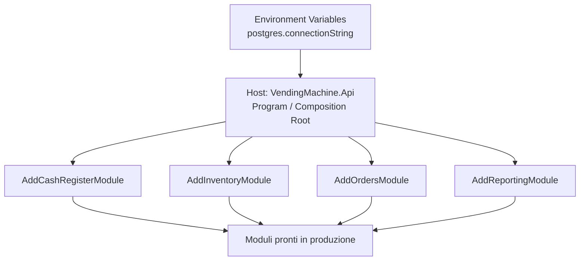
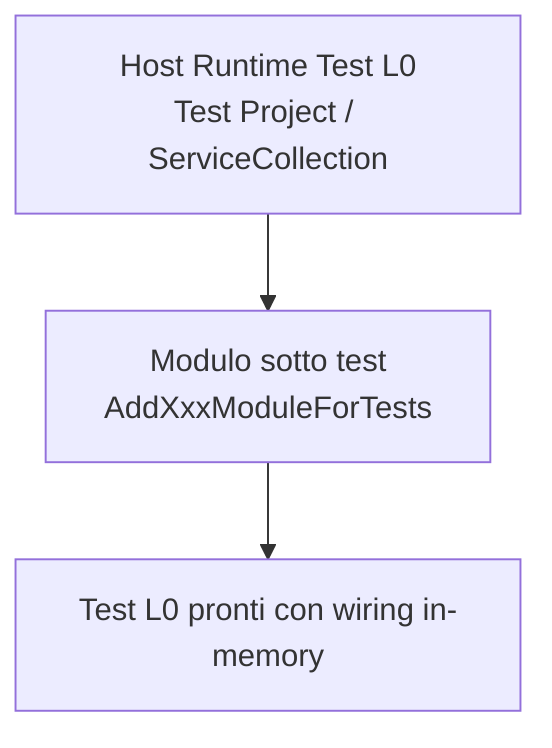

# Modular Monolith - Module Assembly Philosophy

Questo repository adotta una filosofia di montaggio moduli dove l'host applicativo resta semplice:

- l'host decide il contesto (produzione o test)
- il modulo espone API DI esplicite e auto-consistenti
- il modulo incapsula i dettagli infrastrutturali
- la configurazione runtime arriva dall'ambiente (es. connection string)

## Obiettivo

Ridurre la conoscenza infrastrutturale nell'host e mantenere i moduli indipendenti dal tipo di esecuzione.

## Diagramma Mermaid (Produzione)

## Diagramma Mermaid (Test L0)

## Come leggere il diagramma

- l'host API legge la configurazione dall'ambiente
- l'host monta ogni modulo chiamando solo il metodo di produzione
- il risultato è un'app pronta, con moduli caricati e indipendenti dall'host

## Esempio pratico

### Produzione

- host legge la connection string dall'ambiente
- host configura la persistenza reale
- host monta i moduli con AddXxxModule

### Test

- host monta i moduli con AddXxxModuleForTests
- i moduli usano in-memory repository
- la transazionalità usa NoOpUnitOfWork dove necessario

## Benefici

- API DI dei moduli esplicite e leggibili
- host semplificato
- minore coupling tra host e dettagli infrastrutturali
- setup test consistente e ripetibile
